<ImageTitle img="helpdesk.png">Jouw helpdesk via Toolbox</ImageTitle>

De helpdeskmodule van Toolbox wordt beschikbaar gesteld voor gebruik binnen de eigen regio. Op die manier kunnen eigen medewerkers via de Toolbox van hun school niet alleen vragen stellen aan het Toolbox-team, maar ook andere (eventueel ICT-gerelateerde) vragen aan de eigen regionale ICT-medewerkers. Dit alles verloopt via het vraagteken in Toolbox. Werknemers zien in dat geval niet enkel de queue van de Toolbox-helpdesk, maar ook de queue van de eigen school of regio. 

Om gebruik te kunnen maken van de helpdeskmodule, neem je contact op met het Toolbox-team. Wij bekijken samen met jou welke queues er nodig en welke (ICT-)collega's er toegang moeten krijgen tot welke queue. Het Toolbox-team maakt de queues aan en maakt ook de nodige gebruikers aan in ORKA. Van zodra dat in orde is, kan je zelf aan de slag met het verder instellen van de queue.

## 1. Queues instellen

Eens een queue is aangemaakt door het Toolbox-team, kan die door de school/regio zelf verder worden ingesteld. Log in bij ORKA (https://orka.kobavzw.be/) en ga naar de tegel 'Support'.

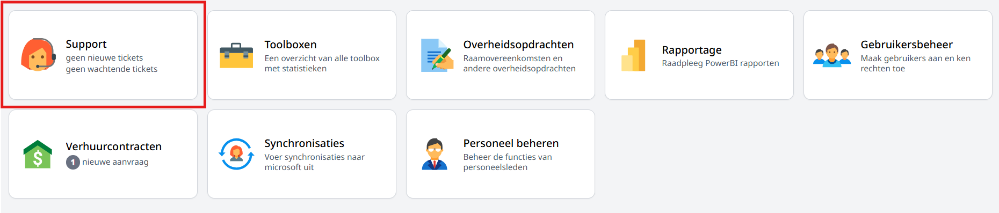

Ga in het menu links naar 'Instellingen'. In dit scherm kan je bovenaan per queue waarop je rechten hebt ook je voorkeuren aangeven wat betreft de notificaties:
- Mail bij nieuw ticket: Je ontvangt een e-mailbericht wanneer iemand een nieuw ticket aanmaakt in deze queue. Van antwoorden binnen een ticket worden geen nieuwe notificaties gestuurd. 
- Mail bij nieuw bericht: Je ontvangt bij elk nieuw bericht in de queue een e-mailbericht. Wanneer je een ticket in behandeling hebt genomen en er wordt een reactie geplaatst op het ticket, ontvang je een mail met het antwoord.   

Selecteer vervolgens de queue die je verder wil instellen. In dit voorbeeld is dat de queue 'ICT De KaBaZ'. 

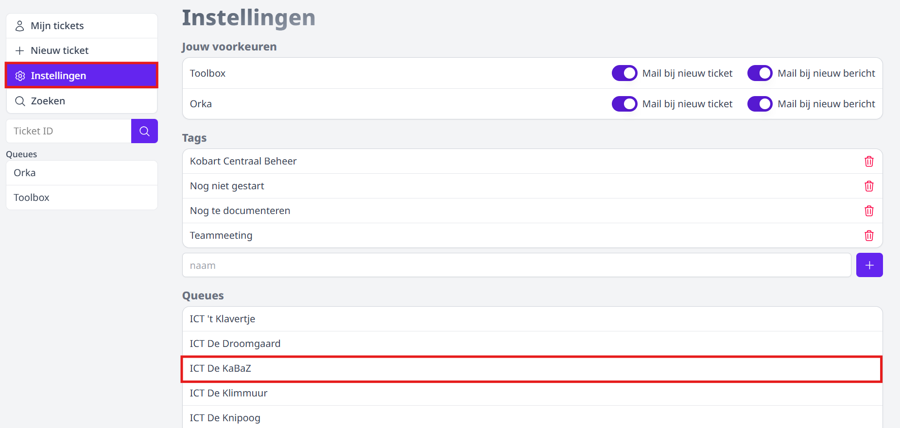

Vul de velden uit de afbeelding hieronder verder aan. Klik op de afbeelding om ze te vergroten. Lees verder onder de afbeelding voor meer info over de beschikbare velden. 

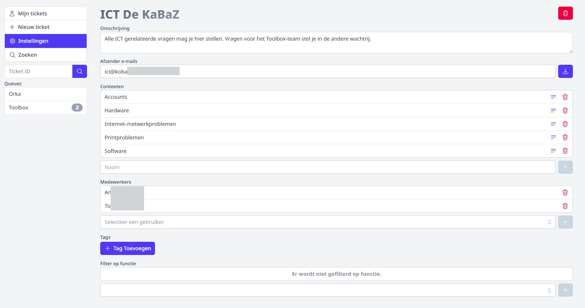

- **Omschrijving**: Geef de queue een duidelijke omschrijving. Toolbox-gebruikers krijgen deze omschrijving te zien wanneer ze de helpdesk vanuit Toolbox raadplegen. Er is in elke Toolbox sowieso ook een queue voorzien voor Toolbox-vragen. Het moet voor de gebruiker aan de hand van de omschrijving dus meteen duidelijk zijn welke vragen in welke queue thuishoren. 

    *Afbeeldingen uit Toolbox:*

    - Omschrijving bij het selecteren van een queue:
    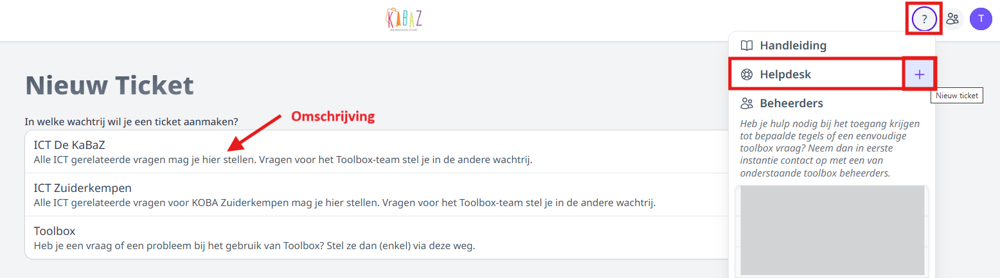

    - Omschrijving bij het invullen van het nieuw ticket na het selecteren van een queue: 
    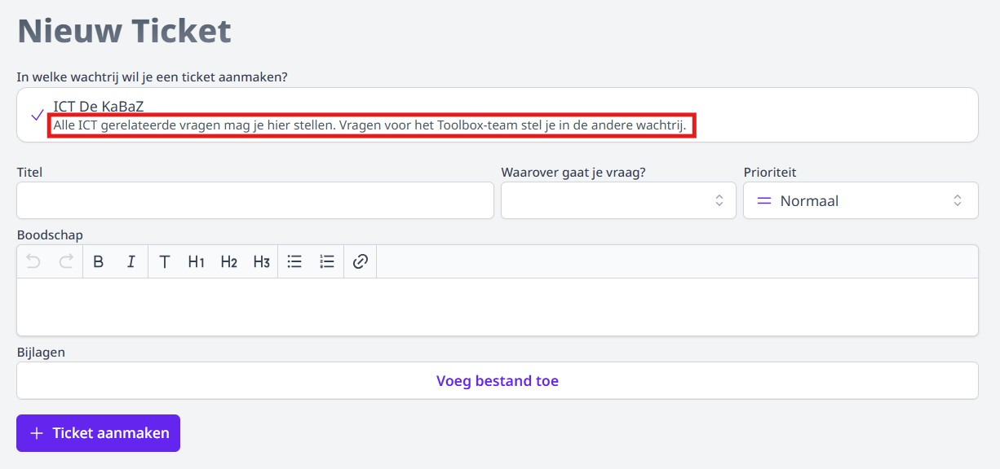

- Stel in wie de **afzender** is van de mails die verstuurd worden bij notificaties. Bij het aanmaken van een nieuw ticket wordt er een notificatie verstuurd naar de medewerkers op de queue op voorwaarde dat zij dit ingesteld hebben bij Support => Instellingen => Jouw voorkeuren. Wanneer één van de medewerkers het ticket heeft beantwoord, wordt er automatisch een notificatie verstuurd naar de aanmaker van het ticket. Bewaar de afzender via volgend icoontje achteraan <LegacyAction img="save.jpg"/>.

- Per queue kunnen er verschillende **contexten** aangemaakt worden. De school/regio kan die zelf aanmaken door in het veld te typen en vervolgens op het plusteken te klikken. Deze functie is optioneel. Contexten zijn de onderwerpen waarop de vragen voor de helpdesk betrekking kunnen hebben. Door gebruik te maken van contexten krijgt uiteraard de vraag op zich meer context, maar is het ook mogelijk om op een snelle manier de vragen voor de helpdesk te verdelen onder de verschillende helpdeskmedewerkers op basis van het onderwerp van de vraag. 

- Alle **medewerkers** uit de regio of school die toegang moeten krijgen als **helpdeskmedewerker** moeten aan de queue worden toegevoegd. Je kan een medewerker zoeken op naam en vervolgens toevoegen met behulp van het plusteken. 

    :::caution opgelet
    Een medewerker is iemand die de tickets mee zal beantwoorden en de queue mee kan instellen. Het zijn niet de medewerkers van de scholen die een vraag moeten kunnen stellen via de helpdesk. 
    :::

- Behalve contexten kan men optioneel ook **tags** aanmaken die gebruikt kunnen worden bij het behandelen van tickets. Een tag is een soort van vlaggetje dat je aan een bepaald ticket kan hangen. Bv. 'Nog te documenteren' wanneer de inhoud van het ticket in een handleiding zou moeten worden verwerkt, 'Teammeeting' als een ticket besproken moet worden op een vergadering, ... In het overzicht van alle tickets kan je filteren op deze tags. 

    - Klik op '+ Tag Toevoegen' om een tag te koppelen aan de queue.
    - Naam tag: Selecteer de gewenste tag uit de lijst. Indien de gewenste tag niet in het lijstje voorkomt, kan je een nieuwe tag definiëren via het menu Support => Instellingen => tags. 
            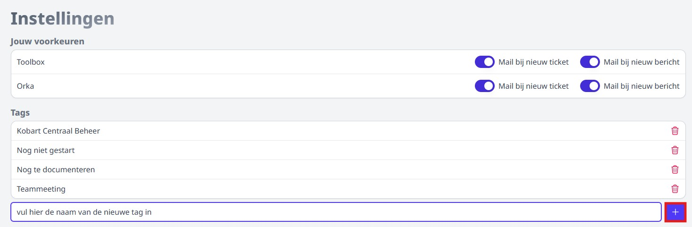
    - Kleur: Geef de tag een kleur door een gekleurde bol te selecteren. Dit zal de kleur van het vlaggetje zijn bij gebruik van de tag in een ticket.  
    - Geef aan of een tag ook **extern beschikbaar** moet zijn. 
        - Indien aan: Bij gebruik van de tag in een ticket kan de persoon die het ticket heeft aangemaakt de tag ook zien. 
        - Indien uit: De tag is enkel zichtbaar voor de agents op de queue (lees: de helpdeskmedewerkers). 

    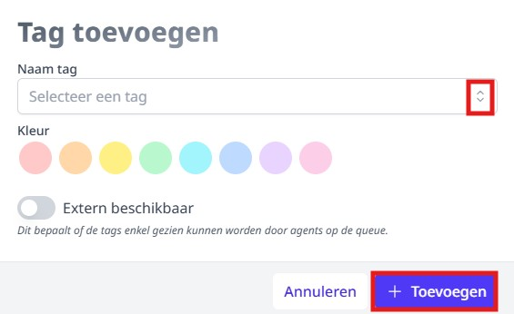

- Indien er geen **functies** worden toegevoegd, kunnen alle personeelsleden van de gekoppelde Toolbox(en) een ticket aanmaken in de queue. Wanneer er wel een functie wordt geselecteerd, kunnen enkel personeelsleden met die bepaalde functie (in Informat) gebruik maken van deze queue in de helpdesk in Toolbox. Er kunnen meerdere functies worden toegevoegd aan één queue. Om gebruik te kunnen maken van deze functionaliteit, moeten er gebruikersgroepen worden aangemaakt in **Informat**. De naam van de gebruikersgroep moet gelijk zijn aan de naam van de functie in ORKA. In ORKA vind je die functies terug door te klikken in het leeg veld bij 'Filter op functie'. Gebruik in Informat exact dezelfde schrijfwijze, alsook komma's, streepjes, ... De gebruikersgroepen van Informat (inclusief gebruikers) worden automatisch gesynchroniseerd met ORKA. 

## 2. Ticket behandelen

### 2.1 Ticket openen

Wanneer een personeelslid in Toolbox een ticket aanmaakt, komt dit binnen in ORKA. Afhankelijk van jouw persoonlijke instellingen op de queue (zie menu 'Support => Instellingen' in ORKA) zal je hiervan ook een e-mailbericht ontvangen. Je kan het ticket via ORKA openen, maar ook rechtstreeks vanuit de mail. 

- Via ORKA: 
    - Links onderaan zie je in welke queue je een nieuw bericht hebt.  
    - Klik op de queue om de ongelezen berichten te raadplegen. 
    - Klik op de lijn met het bericht om het te openen en te behandelen.  

    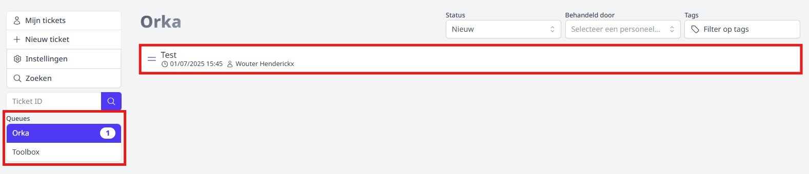

- Via e-mail:

    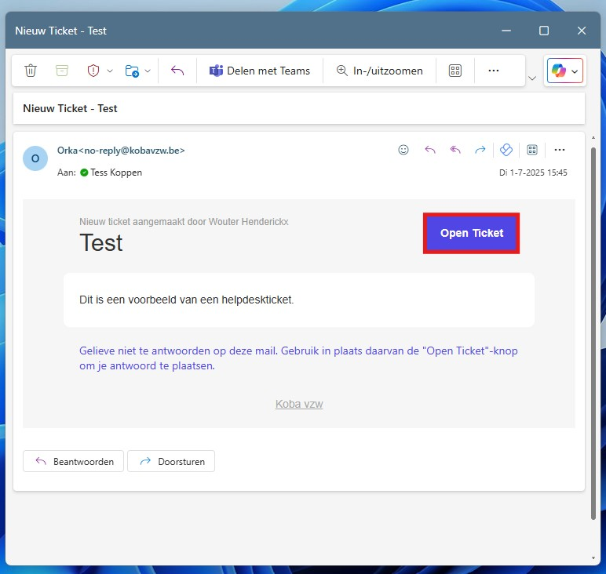

Bij het openen van het ticket vind je rechts op de pagina al heel wat info terug. 
- Elk ticket krijgt een eigen ID die ook in de URL gebruikt wordt, bv. https://orka.kobavzw.be/support/ticket/2898
- Aan de hand van de (door de maker van het ticket) geselecteerde context weet je al over welk onderwerp de supportvraag gaat. 
- Verder zie je door wie het ticket werd aangemaakt en door wie het wordt/werd behandeld indien het reeds toegewezen werd aan een helpdeskmedewerker.  
- Helemaal onderaan in het lijstje vind je de Toolbox terug van waaruit het ticket werd aangemaakt. Je kan die Toolbox op een snelle en eenvoudige manier openen door op de naam van de Toolbox te klikken. 

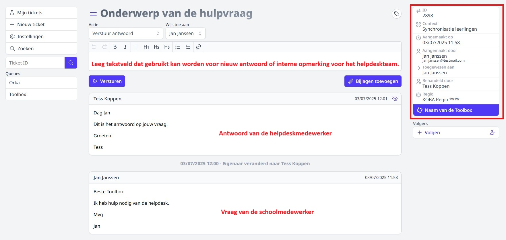

### 2.2 Behandelaar van ticket instellen

Wil je een ticket zelf behandelen, wijs het dan toe aan jezelf. 
- Actie = Stel eigenaar in
- Wordt behandeld door = Mezelf
- Klik op 'Opslaan'

Verwacht je dat een collega met rechten op de queue het ticket beantwoordt, selecteer dan bij 'Wordt behandeld door' de naam van die collega. 

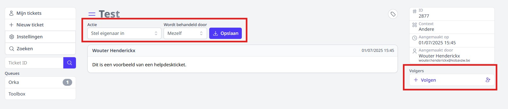

Als een ticket reeds is toegewezen aan jezelf of een collega, kan men steeds van eigenaar/behandelaar wisselen. Bv. wanneer een ticket toch beter door een andere helpdeskmedewerker wordt behandeld. 

- Actie = Verander eigenaar
- Wordt behandeld door = selecteer de naam van de nieuwe behandelaar
- Klik op 'Opslaan'

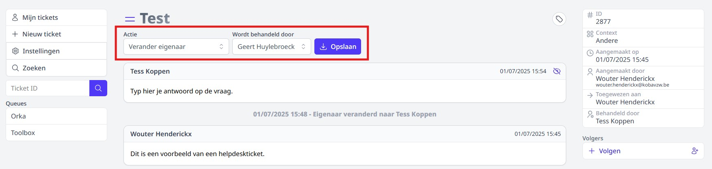

### 2.3 Ticket beantwoorden

Van zodra er een eigenaar is ingesteld, kan je het ticket beantwoorden. Je kan eveneens een bijlage zoals een screenshot of document toevoegen. 
- Actie = Verstuur antwoord
- Wijs toe aan = Naam van de maker van het ticket  Die is reeds automatisch geselecteerd. Deze persoon ontvangt ook automatisch een e-mailbericht op het e-mailadres rechts in de lijst. Dit e-mailadres haalt ORKA op uit Informat. Prioritair wordt er gebruik gemaakt van het type 'School'. Als dat niet beschikbaar is, wordt het e-mailadres van het type 'privé' of 'domicilie' gebruikt. Als er geen e-mailadres is toegevoegd aan Informat, kan er geen e-mailnotificatie verstuurd worden bij het verzenden van het antwoord. De aanvrager kan wel steeds het ticket opvolgen in Toolbox bij het vraagteken. 
- Klik op 'Verzenden'.

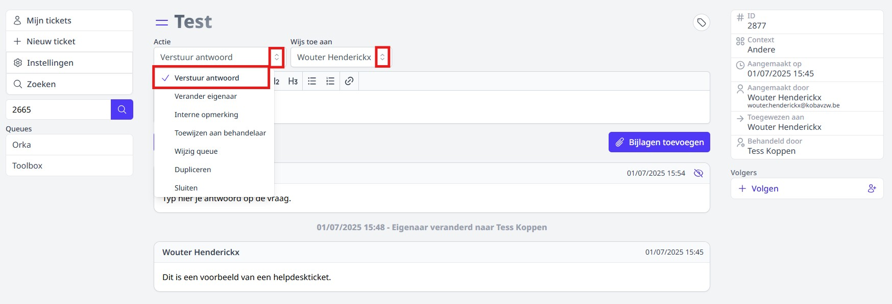

### 2.4 Interne opmerking bij ticket

Het kan nodig zijn om een interne opmerking te geven bij een ticket. Zo'n interne opmerking is enkel zichtbaar voor helpdeskmedewerkers met rechten op de queue. 

- Actie = Interne opmerking
- Klik op 'Verzenden'.

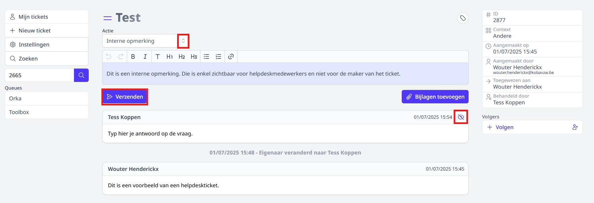

- Je kan een interne opmerking publiek maken door achteraan op het oogje te klikken. Interne opmerkingen hebben steeds een blauwe achtergrondkleur. 
- Je kan ook een publieke opmerking (zoals een antwoord naar de aanvrager) verbergen door achteraan op het oogje te klikken. Publieke opmerkingen hebben steeds een witte achtergrondkleur. 

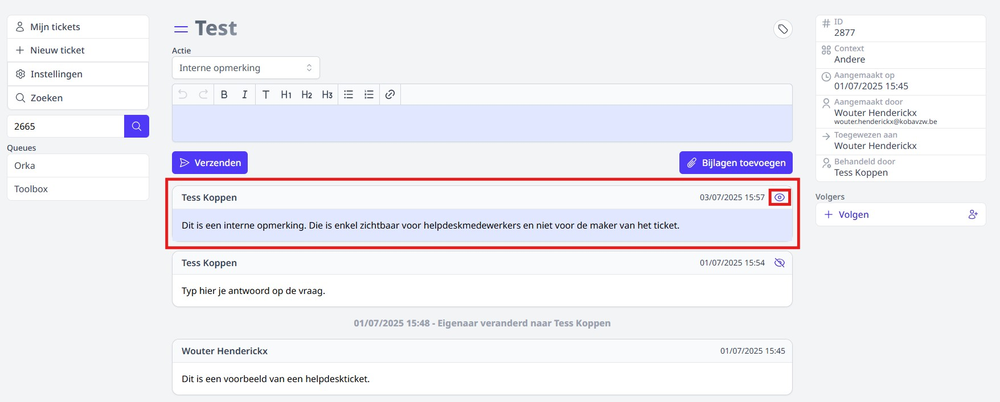

### 2.5 Ticket toewijzen aan andere queue

Wanneer de vraag van de maker van het ticket niet past in deze queue, kan je het ticket verplaatsen naar een andere queue. Helpdeskmedewerkers van die betreffende queue kunnen de vraag vervolgens verder opvolgen. 

- Actie = wijzig queue
- Queues = selecteer de gewenste queue uit de lijst 

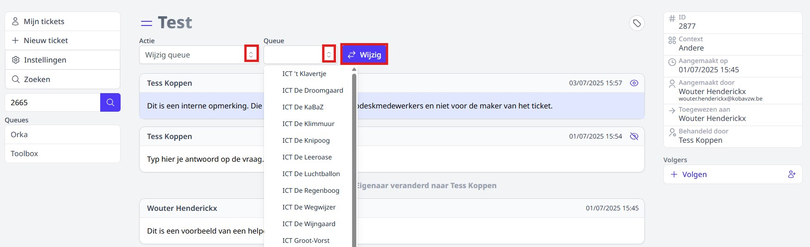

In het ticket wordt gelogd op welke dag en welk tijdstip het ticket is verplaatst van de ene naar de andere queue. In de queue waarnaar het ticket verplaatst is, zal er een melding komen van een nieuw ticket. De helpdeskmedewerkers met rechten op die queue zullen eveneens een e-mailbericht ontvangen. 

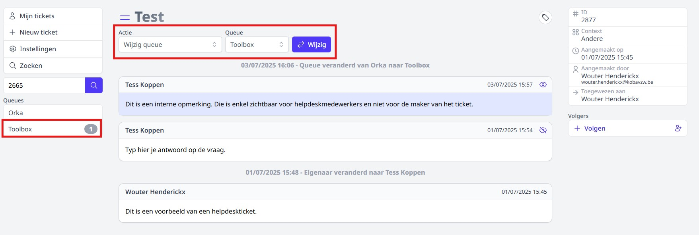

## 3. Ticket van andere behandelaar volgen 

Heb je belang bij of interesse in een ticket dat door een collega-helpdeskmedewerker wordt behandeld, dan kan je dat ticket volgen. Bij elk antwoord van zowel jouw helpdeskcollega als van de maker van het ticket, zal je dan een melding ontvangen. Het is ook mogelijk om personen die geen helpdeskmedewerker zijn als volger toe te voegen aan een ticket.

- Klik op '+ Volgen' om een ticket dat wordt behandeld door jouw helpdeskcollega mee op te volgen. Jij wordt dan toegevoegd als volger van het ticket. 

- Klik op het icoontje van het mannetje achteraan <LegacyAction img="user.png"/> om een andere persoon toe te voegen als volger van het ticket. Typ enkele karakters uit de naam van de volger in en selecteer de gewenste persoon uit de lijst. Deze persoon moet geen helpdeskmedewerker te zijn in de queue.

- Je kan volgers terug verwijderen door achteraan op het rode kruisje te klikken. 

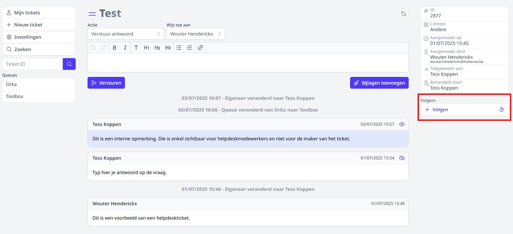

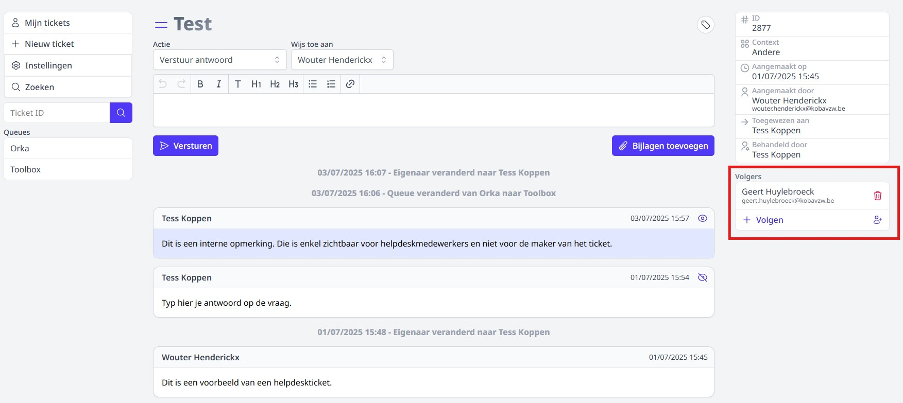

## 4. Eigen tickets opvolgen

Het zou kunnen dat je op een bepaald moment meerdere tickets in behandeling hebt. Je vindt de tickets die aan jou als behandelaar zijn toegewezen steeds terug via het menu 'Mijn tickets' links op de supportpagina. In het overzicht zie je standaard de tickets die nog niet zijn afgesloten. Met behulp van de knoppen bovenaan rechts kan je ook afgesloten tickets raadplegen die door jou behandeld zijn alsook de tickets waaraan jij bent toegevoegd als volger.  
- **In afwachting**: De kolom links geeft de tickets weer waarvoor de behandelaar als laatste een actie heeft ondernomen. In de meeste gevallen heb jij als behandelaar een antwoord of vraag om bijkomende informatie verstuurd naar maker van het ticket. Jij wacht dus op een actie van de tegenpartij. Is een actie van de tegenpartij niet meer nodig, bv. omdat jouw antwoord op het ticket geen verdere actie vraagt, dan kan je het ticket sluiten. Het zal dan verdwijnen uit deze lijst met openstaande tickets. Verwacht je nog wel actie van de tegenpartij, bv. omdat je bijkomende info hebt gevraagd, dan kan je het ticket in deze kolom laten staan.  
- **Te behandelen**: In de kolom rechts staan de tickets waarvoor de maker als laatste een actie heeft ondernomen, bv. een vraag gesteld of het ticket beantwoord. Het ticket wacht in dat geval nog op een actie van de behandelaar. Indien dat toch niet nodig blijkt te zijn, kan je het ticket afsluiten. 

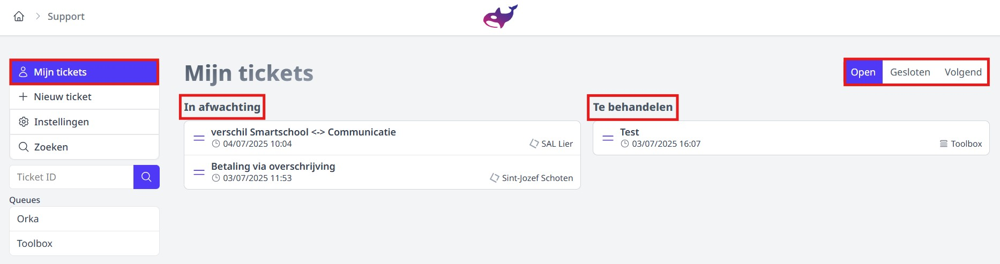

## 5. Ticket afsluiten

Wanneer een ticket volledig is afgehandeld, kan zowel de maker van het ticket als de behandelaar ervan het ticket sluiten.

- Actie = sluiten
- Melding = De persoon die het ticket sluit kan ervoor kiezen om een melding van deze actie te versturen naar de andere partij. In dat geval zal de aanmaker een bericht ontvangen wanneer de behandelaar het ticket sluit en vice versa. 

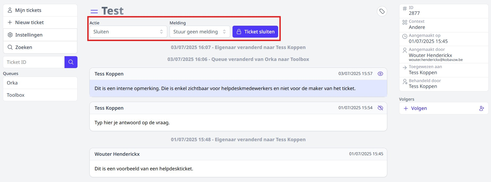

Een ticket kan ook steeds heropend worden indien nodig. 

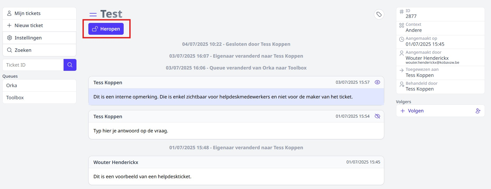

## 6. Tickets zoeken en filteren

Er zijn verschillende manieren om te zoeken en te filteren in de lijst met tickets. 

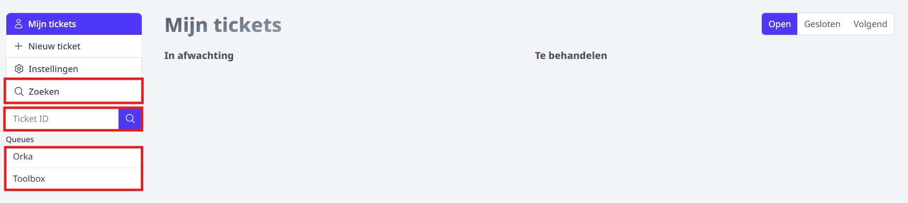

### 6.1 Zoeken m.b.v. een zoekwoord

- Gebruik links in het menu de optie 'Zoeken'. 
- Typ een zoekwoord of een combinatie van woorden in. 
- Er wordt vervolgens gezocht over de queues waarop men rechten heeft heen: 
    - in de titels van de tickets
    - in de inhoud van de tickets
    - op naam van de aanmaker
- Klik op het ticket dat je wenst te openen.

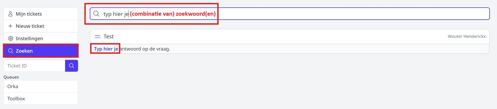

### 6.2 Zoeken op ticketID

Ken je het ID van het ticket dat je wenst op te zoeken? Voer het nummer dan in in het zoekveld links. Het betreffende ticket wordt onmiddellijk geopend bij enteren. 

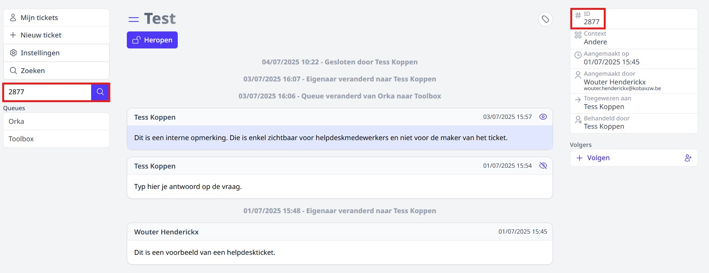

### 6.3 Zoeken en filteren in een bepaalde queue

Ben je op zoek naar tickets in een bepaalde queue of wil je filteren op tickets met een bepaalde tag? Klik dan eerst op de naam van de queue. Vervolgens verschijnen bovenaan een aantal filtermogelijkheden. 

Je kan één van de filtermogelijkheden gebruiken of je kan de verschillende opties combineren. Klik in de resultatenlijst op een ticket om het te openen. Van hieruit kan je een ticket ook behandelen zoals eerder omschreven. 

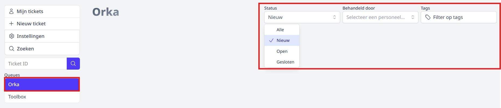

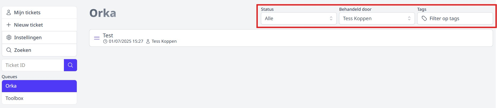

## 7. Zelf support nodig in ORKA?

Heb je een vraag over een module in ORKA? Maak dan een ticket aan in de ORKA queue van de supportmodule. Klik op de supportpagina links op '+ Nieuw ticket'. Medewerkers van Toolbox/ORKA zullen je vraag behartigen. 

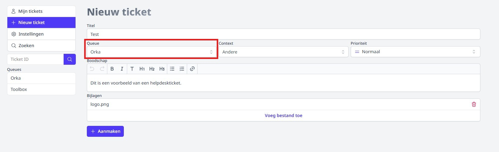
