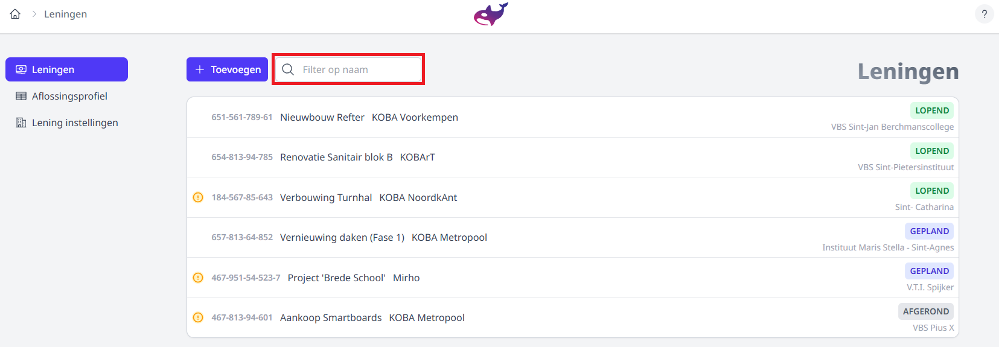
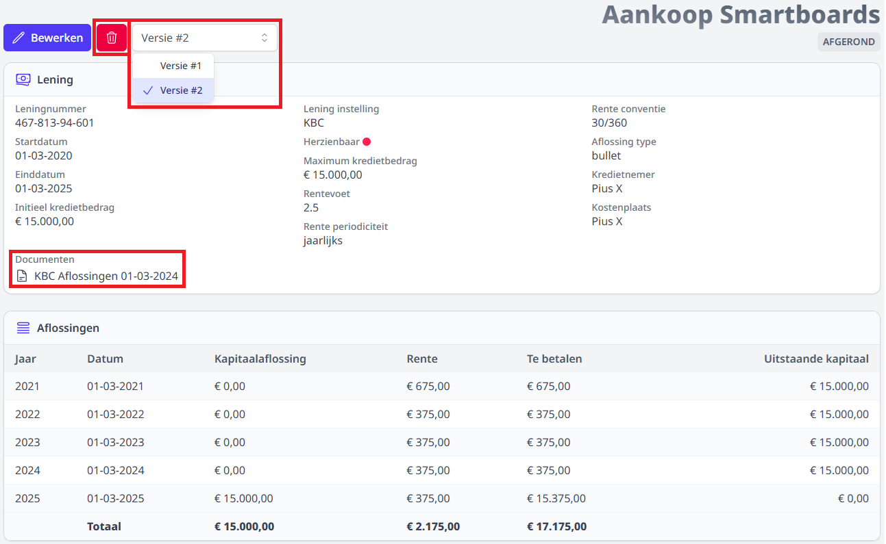
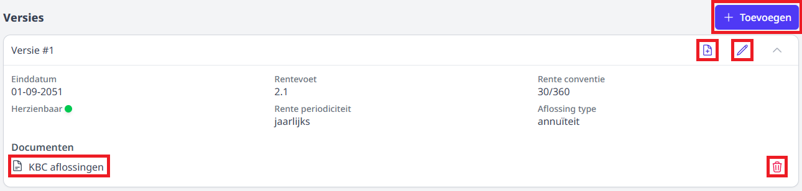
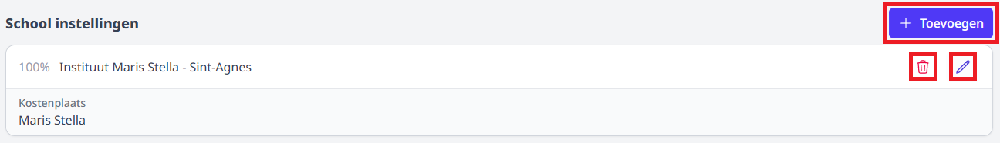
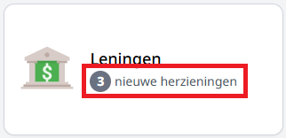
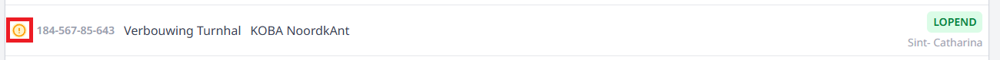
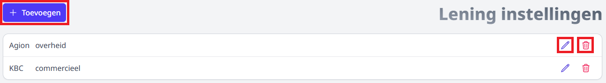

<ImageTitle img="leningen.svg">Leningen</ImageTitle>

Deze module in Orka fungeert als het centrale beheerpunt voor alle leningen. 
Per lening is de volledige geschiedenis, inclusief herzieningen en bijbehorende documentatie, op één plek raadpleegbaar.

Een essentieel onderdeel van deze module is het **aflossingsprofiel**. Dit onderdeel bundelt de data van alle individuele leningen en vertaalt deze naar een overzichtelijk totaalbeeld.

**Boekhouders** kunnen de module in Orka raadplegen om de leningfiches en het aflossingsprofiel van hun eigen regio of school in te zien.

## Leningen

### Filteren
Via de **Filter** kun je zoeken op de naam van een lening.

*Klik op de afbeelding om te vergroten.*

### Toevoegen

Naast het zoekveld bevindt zich de knop 'Toevoegen'. 
Deze verwijst je naar het formulier waar je alle noodzakelijke informatie kunt invoeren om een nieuwe lening aan te maken.

:::info 
Zorg ervoor dat je minstens één [leninginstelling](#lening-instellingen) hebt aangemaakt voordat je een lening toevoegt. 
:::

### Bekijken
Wanneer je op een lening uit de lijst klikt, kom je in het detailoverzicht terecht. 
Hier kun je alle specifieke kenmerken van de lening raadplegen, zoals de verschillende versies, de gekoppelde documenten en de actuele status van het dossier.

*Klik op de afbeelding om te vergroten.*

- Via de **vuilbak-knop** kun je de lening verwijderen.
- Via het **versies-keuzemenu** kun je alle versies van een lening raadplegen.
- Om een **document** gekoppeld aan deze lening te kunnen bekijken of downloaden, klik je op de naam van het document.

#### Aflossingstabel
Bij het aanmaken van een lening wordt de aflossingstabel automatisch berekend op basis van de ingevoerde gegevens.

Na het aanmaken heb je de vrijheid om de tabel handmatig te verfijnen. Indien een specifieke aflossing afwijkt van de standaard berekening, kun je de afzonderlijke cellen in de tabel aanpassen. 

:::caution
Bij het later bewerken van informatie die invloed heeft op de aflossingstabel van een lening of versie, 
zal de automatische berekening opnieuw worden uitgevoerd. Dit zal alle handmatig ingevoerde cellen overschrijven.
:::

### Bewerken

De knop **'Bewerken'** bovenaan verwijst je naar de bewerkingspagina van de lening. Hier kun je de nodige informatie toevoegen of aanpassen.

#### Versies

*Klik op de afbeelding om te vergroten.*

Wanneer je op een versie uit de lijst klikt, krijg je het detailoverzicht te zien. 

- Via de **toevoegen**  knop kun je een nieuwe versie aanmaken.
- Klik op het **potlood** icoon om je versie aan te passen.
:::info
Is de toevoegen-knop grijs? Dit betekent dat de lening gemarkeerd is als niet herzienbaar, waardoor het toevoegen van een nieuwe versie niet mogelijk (en niet nodig) is.
:::

##### Documenten
- Klik op het **document +** icoon om een document toe te voegen aan de lening versie.
- Om een document gekoppeld aan deze versie te kunnen **bekijken of downloaden**, klik je op de naam van het document.
- Via de **vuilbak-knop** achter een document kun je dit bestand verwijderen.

#### School instellingen

*Klik op de afbeelding om te vergroten.*

- Via de **toevoegen** knop kun je een nieuwe schoolinstelling aan de lening koppelen.
- Via de **vuilbak-knop** kun je een schoolinstelling uit de lijst verwijderen.
- Klik op het **potlood** icoon om een bestaande schoolinstelling aan te passen.

### Herzieningen en Meldingen
Wanneer de datum voor een herziening is bereikt of verstreken, herinnert Orka je er aan dat de lening aan herziening toe is.

*Klik op de afbeelding om te vergroten.*

- In het **dashboard** zie je bij de meldingen een teller die aangeeft hoeveel leningen een actie vereisen.
- In de **lijst van leningen** verschijnt er een oranje uitroepteken-icoon voor de naam van de betreffende lening.

Dit betekent dat de huidige versie van de lening is verlopen en dat er nieuwe informatie moet worden ingevoerd via een nieuwe versie.
Zodra je een nieuwe versie met de actuele gegevens hebt aangemaakt en opgeslagen, zal het icoontje verdwijnen en wordt de lening weer als 'up-to-date' beschouwd.

## Aflossingsprofiel
Het Aflossingsprofiel biedt een overzicht van alle leningen.

De tabel is onderverdeeld in de volgende termijnen:

- Minder dan 1 jaar
- Meer dan 1 jaar doch hoogstens 5 jaar
- Meer dan 5 jaar

De data in het aflossingsprofiel wordt tevens opgedeeld per **type leninginstelling**. 
Welke lening in welke kolom terechtkomt, is afhankelijk van de toegewezen leninginstelling en het bijbehorende type.

Onderaan de tabel vind je het totaal nog af te lossen saldo.

## Lening instellingen

Hier krijg je een overzicht van al je aangemaakte Lening instellingen.

*Klik op de afbeelding om te vergroten.*

- Via de **toevoegen** knop maak je een nieuwe instantie aan. 
- Klik op het **potlood** icoon achter een instelling om de naam of het type aan te passen.
- Via de **vuilbak-knop** kun je een instelling verwijderen.

:::info
Je kunt een leninginstelling alleen verwijderen als er geen leningen meer aan gekoppeld zijn
:::

