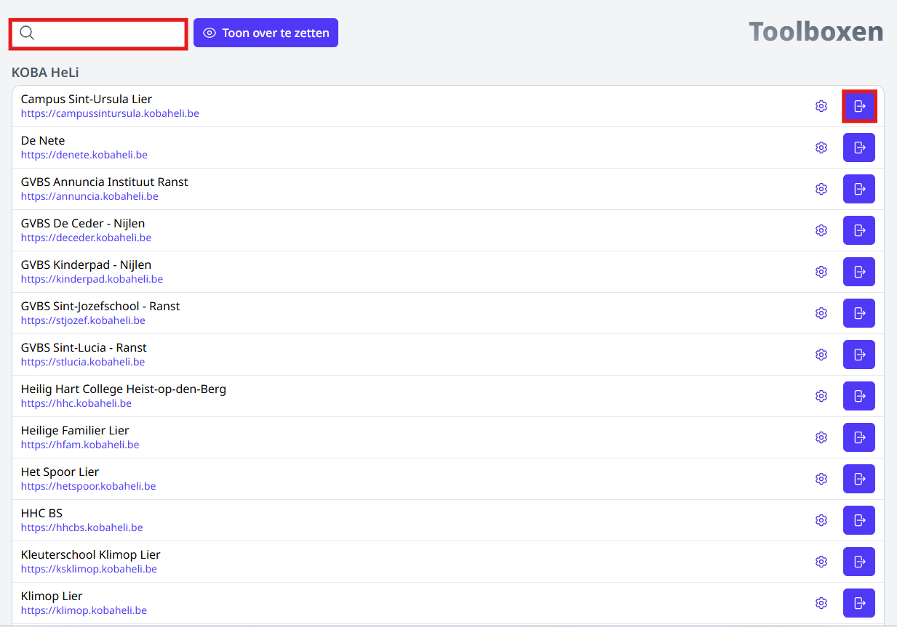
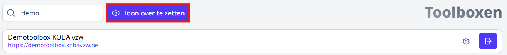
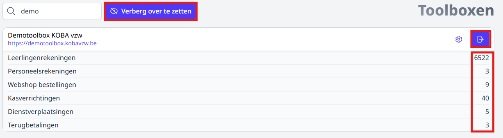
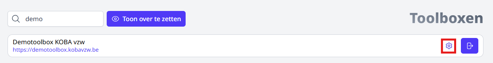
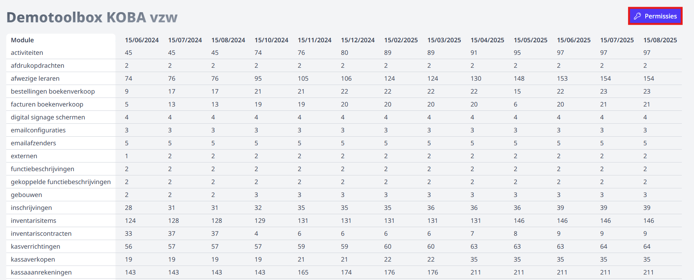
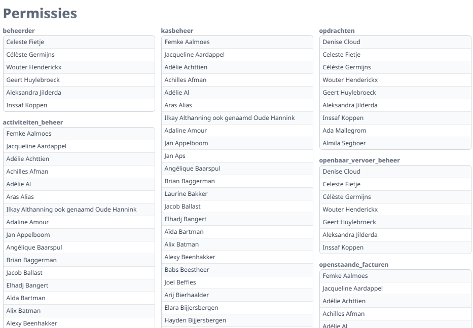

<ImageTitle img="toolboxen.png">Toolboxen</ImageTitle>

Deze module geeft je een overzicht van alle beschikbare Toolboxen in jouw regio en biedt daarnaast enkele handige functionaliteiten.

- Via het zoekveld bovenaan kan je de naam van een school of Toolbox intypen om op die manier te zoeken of te filteren. 

- Met de knop achteraan <LegacyAction img="out.png"/> kan je de bijhorende Toolbox openen. Deze functie werkt enkel in het geval dat je rechten hebt op die betreffende Toolbox. De Toolbox opent in een nieuwe webpagina, waardoor onderstaande pagina in ORKA geopend blijft. Handig dus om een bepaalde actie in meerdere Toolboxen van je regio uit te voeren, bv. het overzetten van de fietsvergoedingen of onkosten. 

    

- Naast het zoekveld bovenaan is er nog de knop 'Toon over te zetten'. Dit is een handige functionaliteit voor (regio)boekhouders. Het toont je meteen voor alle Toolboxen van de regio in welke modules er nog transacties overgezet moeten worden naar Exact Online en ook hoeveel. 

    

- Via de knop <LegacyAction img="out.png"/> kan je meteen de betreffende Toolbox openen om de transacties te verwerken. 
- Wil je lijnen terug verbergen, dan klik je bovenaan naast het zoekveld op 'Verberg over te zetten'. 

    

- Met behulp van het tandwieltje achteraan kan je de statistieken van de betreffende Toolbox raadplegen. Dit is een handige functie om de evolutie van het gebruik van de modules in een bepaalde Toolbox te analyseren. Via deze weg krijg je inzage in bv. het totaal aantal aangevraagde activiteiten, bestellingen via de webshop, inschrijvingen, kasverrichtingen, ... op een bepaalde datum. De cijfers worden maandelijks verwerkt. 

    

- In de tabel met statische gegevens vind je rechtsboven een knop 'Permissies'. Via die knop kan je voor alle Toolbox-modules nagaan welk personeelslid toegang heeft tot welke module. Deze controle voer je best op regelmatige basis uit. Van zodra een personeelslid uit dienst gaat en op non-actief is gezet in Informat, zal die na synchronisatie met Toolbox ook alle gebruikersrechten verliezen. Een accurate personeelsadministratie is dus ook voor Toolbox van groot belang. 

    

    

