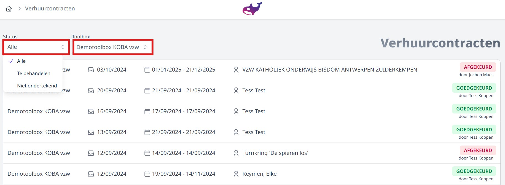
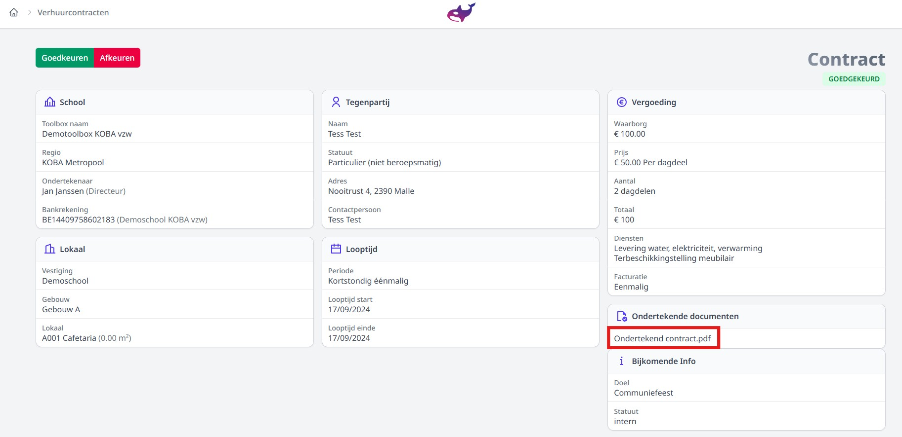

<ImageTitle img="verhuurcontracten.png">Verhuurcontracten</ImageTitle>

Deze module in Orka brengt alle verhuurcontracten uit de verschillende Toolboxen binnen KOBA vzw samen. Vanuit deze module zal de dienst Finance van KOBA de aanvragen uit de Toolboxen goed- of afkeuren en vervolgens het juiste contract eraan koppelen. Na goedkeuring is het contract onmiddellijk beschikbaar in de Toolbox van de school. Ben je benieuwd naar de werking van de module Verhuurcontracten in Toolbox? Klik dan op volgende link: https://handleiding.tbvs.be/Verhuurcontracten

**Boekhouders** kunnen ook toegang krijgen tot de module in Orka. Zij kunnen dan enkel de aanvragen en verhuurcontracten van de eigen regio of school raadplegen. Zij hebben géén rechten om aanvragen goed of af te keuren of om wijzigingen aan te brengen. Voor hen is de module beperkt tot 'alleen lezen'. 

## Filteren

*Klik op de afbeelding om te vergroten.*

- Via de **status** kan je kiezen welke contracten er getoond worden.
- Bij **Toolbox** kan je kiezen voor welke Toolbox je de contracten wil tonen. Selecteer je hier niets, dan krijg je de contracten van alle Toolboxen te zien waarop je rechten hebt. 

## Details aanvraag/contract raadplegen
Door een lijn aan te klikken, kan je de aanvraag openen en de details alsook het contract raadplegen. Je kan de toegevoegde documenten openen door op de naam van het document te klikken. In onderstaand voorbeeld is dat 'Ondertekend contract.pdf'. 

Het is niet mogelijk om wijzigingen aan te brengen in de aanvraag of in het contract. Als dat noodzakelijk is, contacteer dan de dienst Finance van KOBA vzw.

*Klik op de afbeelding om te vergroten.*